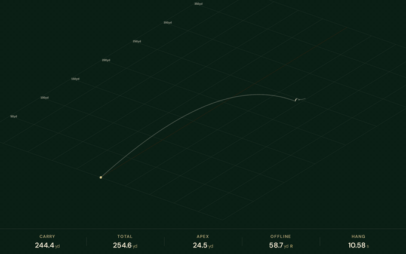

# libgolf

[](https://github.com/gdifiore/libgolf/actions/workflows/ci-multi-platform.yml)
[](https://github.com/gdifiore/libgolf/actions/workflows/static-analysis.yml)
[](LICENSE)


A C++ library that simulates a golf ball's full flight — **aerial arc, bounce, and roll** — from launch conditions. The in-air physics is built on [Prof. Alan M. Nathan's trajectory model](http://baseball.physics.illinois.edu/trajectory-calculator-golf.html) (University of Illinois). Aerodynamics, bounce, and roll are each pluggable, so you can swap in your own physics without touching the simulator.

### ▶ [Try the live 3D visualizer →](https://gdifiore.github.io/libgolf/demo/)

[](https://gdifiore.github.io/libgolf/demo/)

## Quick Example

```cpp
#include <libgolf.hpp>

const LaunchData ball{
    .ballSpeedMph = 160.0f,
    .launchAngleDeg = 11.0f,
    .directionDeg = 0.0f,
    .backspinRpm = 3000.0f,
    .sidespinRpm = 0.0f,
};
const AtmosphericData atmos{
    .temp = 70.0f,
    .elevation = 0.0f,
    .vWind = 0.0f,
    .phiWind = 0.0f,
    .hWind = 0.0f,
    .relHumidity = 50.0f,
    .pressure = 29.92f,
};
GroundSurface ground; // Default fairway

FlightSimulator sim(ball, atmos, ground);
sim.run();

LandingResult result = sim.getLandingResult();
printf("Distance: %.1f yards\n", result.distance);
```

```
Distance: 264.7 yards
```

For terrain with slopes or position-dependent surfaces, see the [Terrain System](/docs/terrain.md).

## Features

- Full trajectory simulation with automatic phase transitions (aerial → bounce → roll)
- Dynamic ground surfaces — fairways, roughs, greens, elevation changes
- 3D terrain system with slopes and varying surface normals
- Pluggable aerodynamic model — implement custom Cd/Cl/spin-decay behaviour
- Pluggable bounce model — replace COR/friction/spin physics on impact
- Pluggable roll model — replace friction law, integrator, and stop criterion
- Efficient step-by-step numerical integration

## Requirements

- C++20 or later
- CMake 3.14+

## Build

```bash
git clone https://github.com/gdifiore/libgolf.git
cd libgolf
chmod +x build.sh
./build.sh
```

## Using libgolf in your project

After installing (`cmake --install build`), consume it from another CMake
project with `find_package`:

```cmake
find_package(golf REQUIRED)

add_executable(my_app main.cpp)
target_link_libraries(my_app PRIVATE golf::golf)
```

`golf::golf` carries its include paths, so `#include <libgolf.hpp>` works with
no extra configuration. The same target name is available via
`add_subdirectory(libgolf)` for in-tree builds.

## Documentation

- [Getting Started](/docs/how.md) — Basic usage and examples
- [Terrain System](/docs/terrain.md) — Custom terrain with elevation, slopes, and varying surfaces
- [Aerodynamic Models](/docs/aerodynamic_model.md) — Custom drag, lift, and spin-decay models
- [Bounce Models](/docs/bounce_model.md) — Custom ball-ground bounce physics
- [Roll Models](/docs/roll_model.md) — Custom rolling friction and stopping criteria
- [WebAssembly Build](/docs/wasm.md) — Compile to wasm and use libgolf from JavaScript

### Web Visualizer

The 3D ball-flight visualizer above is hosted on GitHub Pages at
**[gdifiore.github.io/libgolf/demo/](https://gdifiore.github.io/libgolf/demo/)**.
Source: [`examples/web/index.html`](/examples/web/index.html). To run locally,
see [docs/wasm.md](/docs/wasm.md).
